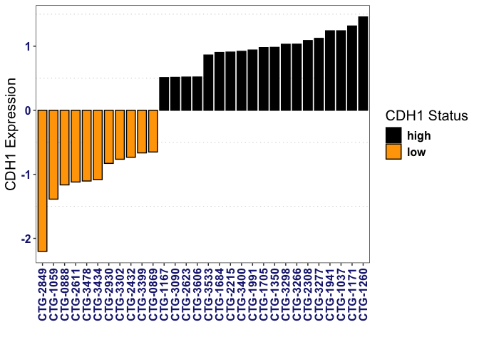
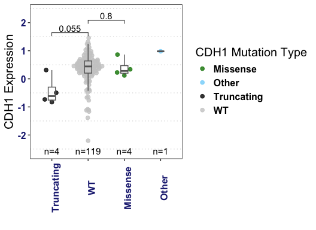
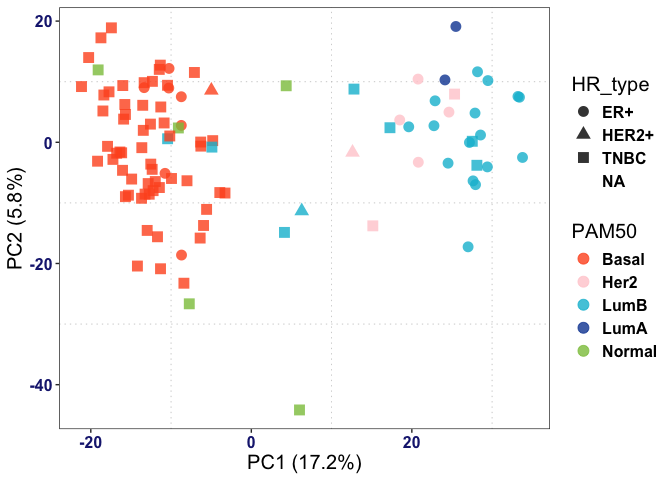
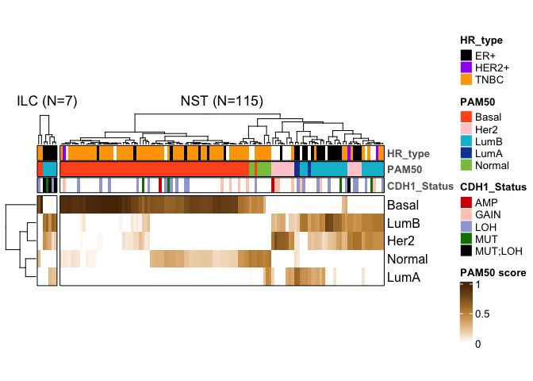
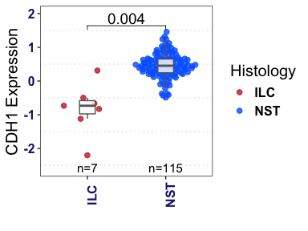
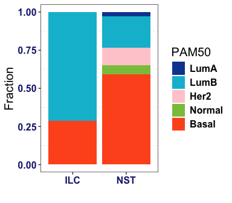
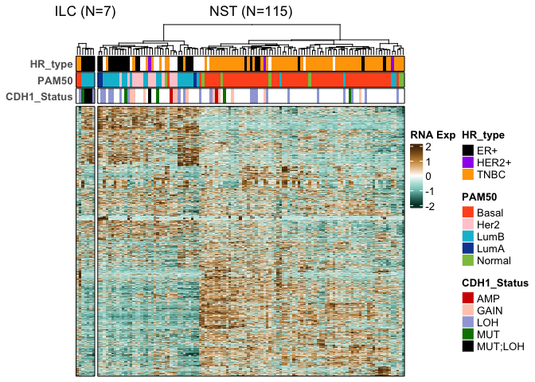
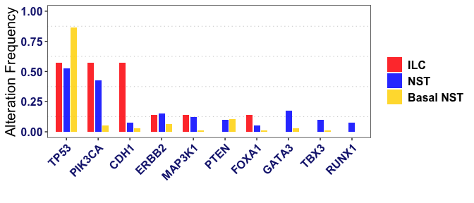

Champions Oncology ILC PDX Multiomics Dataset Analysis
================
Osama Shiraz Shah
2025-08-30

<br>

**DISCLAIMER** This respository can reproduce the bioinformatics
analysis in “Identification and Credentialing of Patient Derived
Xenograft Models of Invasive Lobular Breast Carcinoma using Multi-omics
and Histopathology assessment”. Run the script in sequential order. Make
sure packages listed in the session info text file are installed.
Changes in R and/or its package versions may result in changes in the
expected output.

**LICENSING** <https://creativecommons.org/licenses/by-nc-nd/4.0/> This
code/data is distributed under Creative Commons
Attribution-NonCommercial-NoDerivatives License 4.0 (CC BY-NC-ND).

<br>

------------------------------------------------------------------------

### Data Analysis

#### Setup Environment

``` r
knitr::opts_chunk$set(
  fig.path = "figures/"   # saves all plots to figures/
)
```

``` r
`%notin%`=Negate(`%in%`)

library(magrittr)
library(ggplot2)
library(cowplot)
library(dplyr)
```

    ## 
    ## Attaching package: 'dplyr'

    ## The following objects are masked from 'package:stats':
    ## 
    ##     filter, lag

    ## The following objects are masked from 'package:base':
    ## 
    ##     intersect, setdiff, setequal, union

``` r
library(EnvStats)
```

    ## 
    ## Attaching package: 'EnvStats'

    ## The following objects are masked from 'package:stats':
    ## 
    ##     predict, predict.lm

``` r
library(ggpubr)
```

    ## 
    ## Attaching package: 'ggpubr'

    ## The following object is masked from 'package:cowplot':
    ## 
    ##     get_legend

``` r
library(gridExtra)
```

    ## 
    ## Attaching package: 'gridExtra'

    ## The following object is masked from 'package:dplyr':
    ## 
    ##     combine

``` r
library(ggthemes)
```

    ## 
    ## Attaching package: 'ggthemes'

    ## The following object is masked from 'package:cowplot':
    ## 
    ##     theme_map

``` r
library(reshape2)
library(ComplexHeatmap)
```

    ## Loading required package: grid

    ## ========================================
    ## ComplexHeatmap version 2.22.0
    ## Bioconductor page: http://bioconductor.org/packages/ComplexHeatmap/
    ## Github page: https://github.com/jokergoo/ComplexHeatmap
    ## Documentation: http://jokergoo.github.io/ComplexHeatmap-reference
    ## 
    ## If you use it in published research, please cite either one:
    ## - Gu, Z. Complex Heatmap Visualization. iMeta 2022.
    ## - Gu, Z. Complex heatmaps reveal patterns and correlations in multidimensional 
    ##     genomic data. Bioinformatics 2016.
    ## 
    ## 
    ## The new InteractiveComplexHeatmap package can directly export static 
    ## complex heatmaps into an interactive Shiny app with zero effort. Have a try!
    ## 
    ## This message can be suppressed by:
    ##   suppressPackageStartupMessages(library(ComplexHeatmap))
    ## ========================================

``` r
annot_cols <- list(Histology=c("ILC"="#c62828","ILC-like"="purple","NST"="#0066ff", "Other"="gray","Fibroblast"="#9c7a3b"),
                   PAM50=c("LumA"="#0D47A1","LumB"="#00BCD4","Her2"="#ffcdd2","Basal"="#FF5722","Normal"="#8BC34A"),
                   HR_type=c("ER+"="black","TNBC"="orange", "HER2+" = "purple","NA"="gray"),
                   CDH1_RNA = circlize::colorRamp2(c(-2,-1, 0, 1, 2), colors =c("#003d30", "#7dc8bf","white", "#ca9446", "#543005"), space = 'RGB'))

alteration_cols = c("GAIN"= "#FFCCBC", "LOH" = "#9FA8DA",  "AMP" = "#d50000", "DEL"= "#2962FF", "WT" = "gray", 
                    "MUT" = "#008000", "MUT;LOH" = "black", "MUT;GAIN" = "#FFB300", "MUT;AMP" = "#F4511E")


library(ggplot2)
library(ggpubr)
myTheme <- function(text_size = 15, axis_text_size = 12, legend_text_size = 12, subtitle_size = 8) {
  theme_bw() +
    theme(
      # TEXT
      text = element_text(size = text_size),
      axis.text = element_text(size = axis_text_size, face = "bold", color = "#1A237E"),
      legend.text = element_text(size = legend_text_size, face = "bold"),
      plot.subtitle = element_text(size = subtitle_size, face = "bold"),
      
      # BACKGROUND
      legend.background = element_rect(fill = "white", size = 4, colour = "white"),
      panel.grid.major = element_blank(),
      panel.grid.minor = element_line(color = "#BDBDBD", linetype = "dotted")
      
    )
}
```

#### Load Data

``` r
clinical_data = readxl::read_excel("./input/clinical_data.xlsx") %>% as.data.frame()
rownames(clinical_data) = clinical_data$Model

load("./input/pam50_subtypes_df.Rdata")

load("./input/rna_logtpm.Rdata")
rna_zscore = t(scale(t(rna_logtpm)))
load("./input/alteration_gam_snv_cnv.Rdata")
```

``` r
# Add alteration status columns from alteration_gam (columns must be model IDs)
clinical_data$`CDH1 Alteration Status`   <- alteration_gam["CDH1",  clinical_data$Model]
clinical_data$`PIK3CA Alteration Status` <- alteration_gam["PIK3CA", clinical_data$Model]
clinical_data$`TP53 Alteration Status`   <- alteration_gam["TP53",  clinical_data$Model]
clinical_data$`ERBB2 Alteration Status`  <- alteration_gam["ERBB2", clinical_data$Model]
clinical_data$`CDH1 Mutation Effect`[is.na(clinical_data$`CDH1 Mutation Effect`)] = "WT"


# HR_type parsed from clinical HR string
clinical_data$HR_type <- ifelse(grepl("^HER2\\+", clinical_data$ER.PR.HER2.clinical.status), "HER2+",
                          ifelse(grepl("Triple negative", clinical_data$ER.PR.HER2.clinical.status), "TNBC",
                          ifelse(grepl("^ER\\+", clinical_data$ER.PR.HER2.clinical.status), "ER+", NA)))

# PAM50
clinical_data$PAM50 = PAM50.subtype$subtype[clinical_data$Model]
```

#### Table S1 - Putative ILCs

``` r
# =========================
# Table S1 table (clinical + RNA + alterations + mutations)
# =========================

# Confirmed labels based on IHC
confirmed_ILC   <- c("CTG-2432","CTG-2849","CTG-3283","CTG-3399","CTG-2810","CTG-2611","CTG-2930")
confirmed_mixed <- c("CTG-3434")

clinical_data$Putative_ILC <- ifelse(
  clinical_data$`CDH1 mRNA Levels` == "low" | clinical_data$`CDH1 Mutation Effect` == "Truncating", "Y", ""
)

clinical_data$Type <- ifelse(clinical_data$Putative_ILC == "Y", "Putative ILC", "NST")
clinical_data$Type[clinical_data$Model %in% confirmed_ILC]   <- "ILC"
clinical_data$Type[clinical_data$Model %in% confirmed_mixed] <- "mDLC"

clinical_data$`Confirmed ILC` = ifelse(clinical_data$Model %in% confirmed_ILC, "Y", "")
xlsx::write.xlsx(x = clinical_data[, grep("Type", colnames(clinical_data), invert = T)], row.names = F,
                 sheetName = "Putative ILC PDX", file = "./2025 - Champions Oncology PDX N 128 Summary.xlsx")

clinical_data_confirm <- subset(clinical_data, Type != "Putative ILC" & Model != confirmed_mixed)
```

#### Fig 1A - CDH1 mRNA distribution

``` r
# all PDX
df <- subset(clinical_data, `CDH1 mRNA Levels` %in% c("low","high"))
ord <- df[order(df$`CDH1 Expression`, decreasing = TRUE), ]
top_cdh1    <- head(ord, 15)
bottom_cdh1 <- tail(ord, 15)

ggplot(rbind(top_cdh1, bottom_cdh1),
       aes(y = `CDH1 Expression`, x = reorder(Model, `CDH1 Expression`), fill = `CDH1 mRNA Levels`)) +
  geom_col(color = "black", width = 0.8) +
  scale_fill_manual("CDH1 Status", values = c("low"="orange","mid"="gray","high"="black")) +
  myTheme(15) + theme(axis.text.x = element_text(angle = 90, hjust = 0, vjust = 0.5)) +
  ylab("CDH1 Expression") + xlab("")
```

    ## Warning: The `size` argument of `element_rect()` is deprecated as of ggplot2 3.4.0.
    ## ℹ Please use the `linewidth` argument instead.
    ## This warning is displayed once every 8 hours.
    ## Call `lifecycle::last_lifecycle_warnings()` to see where this warning was
    ## generated.

<!-- -->

#### Fig 1B - Lollipop Plot with CDH1 Mutations

To reproduce the CDH1 lollipop plot, please input the following text
onto the lollipop app on
<a href="https://proteinpaint.stjude.org/" class="uri">ProteinPaint</a>
website.

| **Protein Paint Input**        |
|--------------------------------|
| p.E494fs, chr16:68849575, X    |
| p.V460fs, chr16:68849473, X    |
| p.T748fs, chr16:68862153, X    |
| p.Q23\*, chr16:68772218, X     |
| p.A592T, chr16:68855966, S     |
| Intron, chr16:68846252, Intron |
| p.P30T, chr16:68772239, S      |
| p.E165K, chr16:68842432, S     |
| p.D777N, chr16:68863590, S     |

You can also refer to the following youtube tutorial for guidance and
instructions: <a
href="https://www.youtube.com/watch?v=_Bin_jZBcss&amp;ab_channel=BioNBytes"
class="uri">Lollipop App Usuage Tutorial</a>

#### Fig 1C - CDH1 mRNA levels in Mutated vs WT cases

``` r
# all PDX
ggplot(clinical_data, aes(x = reorder(`CDH1 Mutation Effect`, `CDH1 Expression`),
                          y = `CDH1 Expression`)) + ylim(c(-2.6, 2.4)) + EnvStats::stat_n_text() + 
  ggbeeswarm::geom_quasirandom(alpha = 0.8, size = 2, aes(color = `CDH1 Mutation Effect`)) +
  geom_boxplot(alpha = 0.1, outlier.shape = NA, colour = "gray40", width = 0.2) +
  scale_color_manual("CDH1 Mutation Type",
                    values = c("Truncating"="black","Missense"="#008000","WT"="gray80","Other"="#81D4FA")) +
  myTheme(15) + xlab("") + ylab("CDH1 Expression") + theme(axis.text.x = element_text(angle = 90)) +
  stat_compare_means(comparisons = list(c("Truncating", "WT"), c("WT", "Missense")), method = "t.test")
```

<!-- -->

#### Fig S1A - PCA plot of confirmed ILC vs NST cases

``` r
# only assessing confirmed ILC and NST cases (excluding putative ILC and mixed cases)

samples_use <- clinical_data_confirm$Model
feature_vars <- apply(rna_logtpm[, samples_use, drop = FALSE], 1, var)
feature_vars <- sort(feature_vars, decreasing = TRUE)
n_feat <- max(1, floor(length(feature_vars) * 0.10))
select_features <- names(feature_vars)[seq_len(n_feat)]

set.seed(123); pca_res <- prcomp(t(rna_logtpm[select_features, samples_use, drop = FALSE]), scale. = TRUE)
pca_df  <- as.data.frame(pca_res$x[, 1:2, drop = FALSE])
pca_df$Model <- rownames(pca_df)

ve <- summary(pca_res)$importance["Proportion of Variance", 1:2]
labs <- paste0(c("PC1","PC2"), " (", round(ve*100,1), "%)")

plot_df <- dplyr::left_join(
  pca_df, clinical_data_confirm[, c("Model","HR_type","PAM50")],
  by = "Model"
)

ggplot(plot_df, aes(PC1, PC2, color = PAM50, shape = HR_type)) +
  geom_point(size = 3.5, alpha = 0.8) + scale_color_manual("PAM50",values = annot_cols$PAM50) +
  myTheme(15) + xlab(labs[1]) + ylab(labs[2]) +
  scale_shape_discrete(drop = FALSE)
```

    ## Warning: Removed 18 rows containing missing values or values outside the scale range
    ## (`geom_point()`).

<!-- -->

#### Fig S1B - PAM50 heatmap of confirmed ILC vs NST cases

``` r
library(ComplexHeatmap); library(circlize)
```

    ## ========================================
    ## circlize version 0.4.16
    ## CRAN page: https://cran.r-project.org/package=circlize
    ## Github page: https://github.com/jokergoo/circlize
    ## Documentation: https://jokergoo.github.io/circlize_book/book/
    ## 
    ## If you use it in published research, please cite:
    ## Gu, Z. circlize implements and enhances circular visualization
    ##   in R. Bioinformatics 2014.
    ## 
    ## This message can be suppressed by:
    ##   suppressPackageStartupMessages(library(circlize))
    ## ========================================

``` r
pam_mat <- t(PAM50.subtype$subtype.proba[samples_use, , drop = FALSE])

colFun3 <- circlize::colorRamp2(c(0, 0.5, 1), c("white", "#ca9446", "#543005"))

top_annots <- function(ids) {
  HeatmapAnnotation( annotation_name_side = "right", border = TRUE,
    HR_type = clinical_data_confirm[ids, "HR_type", drop = TRUE],
    PAM50   = clinical_data_confirm[ids, "PAM50", drop = TRUE],
    CDH1_Status = clinical_data_confirm[ids, "CDH1 Alteration Status", drop = TRUE],
    annotation_name_gp = gpar(fontsize = 10, fontface="bold", col="#616161"),
    na_col = "white",
    col = list(HR_type = annot_cols$HR_type, PAM50= annot_cols$PAM50, CDH1_Status = alteration_cols
    )
  )
}

set.seed(123)
pam_ht <- Heatmap(
  pam_mat, col = colFun3, name = "PAM50 score", height = unit(3, "cm"),
  show_column_names = FALSE, show_row_names = TRUE, border = TRUE,
  cluster_row_slices = FALSE, cluster_column_slices = FALSE,
  column_split = clinical_data_confirm$Type,
  column_title = paste0(names(table(clinical_data_confirm$Type)),
                        paste0(" (N=", as.vector(table(clinical_data_confirm$Type)), ")")),
  top_annotation = top_annots(samples_use)
)
draw(pam_ht, merge_legends = TRUE)
```

<!-- -->

#### Fig S1C - CDH1 mRNA in confirmed ILC vs NST cases

``` r
ggplot(clinical_data_confirm, aes(x = reorder(Type, `CDH1 Expression`), y = `CDH1 Expression`)) + 
  ggbeeswarm::geom_quasirandom(alpha = 0.8, size = 2, aes(color = Type)) +
  geom_boxplot(alpha = 0.8, outlier.shape = NA, colour = "gray40", width = 0.2) +
  myTheme(15) + xlab("") + ylab("CDH1 Expression") + theme(axis.text.x = element_text(angle = 90)) +
    scale_color_manual("Histology", values = c("ILC"="#c62828","NST"="#0066ff")) +
  ggpubr::stat_compare_means(comparisons = list(c("ILC","NST")),
                             method = 't.test', size = 5) +
  EnvStats::stat_n_text() + ylim(c(-2.6, 2))
```

<!-- -->

#### Fig 3A - PAM50 distribuition of confirmed ILC vs NST

``` r
PAM50_df <- clinical_data_confirm |>
  dplyr::filter(!is.na(PAM50)) |>
  dplyr::group_by(Type, PAM50) |>
  dplyr::summarise(n = dplyr::n(), .groups = "drop_last") |>
  dplyr::mutate(Freq = n/sum(n)) |>
  dplyr::ungroup() |>
  dplyr::mutate(PAM50 = factor(PAM50, levels = c("LumA","LumB","Her2","Normal","Basal")))

# Fisher exact (Luminal vs non-Luminal)
luminal_df <- clinical_data_confirm[, c("Type","PAM50")]
luminal_df$LumVsNon <- ifelse(luminal_df$PAM50 %in% c("LumA","LumB"), "Lum", "nonLum")
print(fisher.test(table(luminal_df$Type, luminal_df$LumVsNon)))
```

    ## 
    ##  Fisher's Exact Test for Count Data
    ## 
    ## data:  table(luminal_df$Type, luminal_df$LumVsNon)
    ## p-value = 0.01331
    ## alternative hypothesis: true odds ratio is not equal to 1
    ## 95 percent confidence interval:
    ##   1.222333 88.357367
    ## sample estimates:
    ## odds ratio 
    ##   7.973805

``` r
ggplot(PAM50_df, aes(Type, Freq, fill = PAM50)) +
  geom_col(position="stack") +
  scale_fill_manual("PAM50", values = annot_cols$PAM50) +
  xlab("") + ylab("Fraction") +
  myTheme(15)
```

<!-- -->

#### Fig 3B - Top 10% Variable Gene Heatmap of confirmed ILC vs NST cases

``` r
RNA_mat <- t(scale(t(as.matrix(rna_logtpm[select_features, samples_use, drop = FALSE]))))

colFun1 <- circlize::colorRamp2(c(-2,-1,0,1,2), c("#003d30","#7dc8bf","white","#ca9446","#543005"))

top_annots2 <- function(ids) {
  HeatmapAnnotation(
    annotation_name_side = "left", border = TRUE,
    HR_type     = clinical_data[ids, "HR_type", drop = TRUE],
    PAM50       = clinical_data[ids, "PAM50", drop = TRUE],
    CDH1_Status = clinical_data[ids, "CDH1 Alteration Status", drop = TRUE],
    annotation_name_gp = gpar(fontsize = 10, fontface="bold", col="#616161"),
    na_col = "white",
    col = list(
      HR_type = annot_cols$HR_type,
      PAM50   = annot_cols$PAM50,
      CDH1_Status = alteration_cols
    )
  )
}

set.seed(123)
ht <- Heatmap(
  RNA_mat[, samples_use, drop = FALSE], col = colFun1, name = "RNA Exp",
  column_split = clinical_data_confirm[samples_use, "Type"],
  column_title = paste0(names(table(clinical_data_confirm[samples_use, "Type"])),
                        paste0(" (N=", as.vector(table(clinical_data_confirm[samples_use, "Type"])), ")")),
  show_row_dend = FALSE, show_column_names = FALSE, show_row_names = FALSE,
  clustering_method_columns = "ward.D2", clustering_method_rows = "ward.D2",
  cluster_column_slices = F, border = TRUE,
  top_annotation = top_annots2(samples_use)
)
draw(ht)
```

<!-- -->

#### Fig 3C - Enriched Mutations in confirmed ILC vs basal/non-basal NST cases

``` r
genes <- c("CDH1","PIK3CA","RUNX1","ERBB2","TP53","TBX3","PTEN","FOXA1","GATA3","MAP3K1")

ILC_samples <- subset(clinical_data_confirm, Type == "ILC")$Model

nonBasal_cases = subset(as.data.frame(PAM50.subtype$subtype.proba[clinical_data_confirm$Model, ]), 
                   (Basal < 0.1 & (LumB > 0.2 | LumA > 0.2))) %>% rownames()

NST_samples <- subset(clinical_data_confirm, Type == "NST" & Model %in% nonBasal_cases)$Model
bNST_samples <- subset(clinical_data_confirm, Type == "NST" & Model %notin% nonBasal_cases)$Model

ILC_mat <- alteration_gam[genes, ILC_samples, drop = FALSE]
NST_mat <- alteration_gam[genes, NST_samples, drop = FALSE]
bNST_mat <- alteration_gam[genes, bNST_samples, drop = FALSE]

# Presence/absence call: any non-empty code besides copy-state-only labels
rm_levels <- c("WT","LOH","GAIN","AMP","DEL","")
ILC_bin <- ILC_mat; ILC_bin[ILC_bin %in% rm_levels] <- ""; ILC_bin[ILC_bin != ""] <- "Alt"
NST_bin <- NST_mat; NST_bin[NST_bin %in% rm_levels] <- ""; NST_bin[NST_bin != ""] <- "Alt"
bNST_bin <- bNST_mat; bNST_bin[bNST_bin %in% rm_levels] <- ""; bNST_bin[bNST_bin != ""] <- "Alt"

df_freq <- data.frame(
  ILC = rowSums(ILC_bin != "", na.rm = TRUE)/pmax(1, ncol(ILC_bin)),
  NST = rowSums(NST_bin != "", na.rm = TRUE)/pmax(1, ncol(NST_bin)),
  `Basal NST` = rowSums(bNST_bin != "", na.rm = TRUE)/pmax(1, ncol(bNST_bin)),
  check.names = FALSE
)
df_freq$gene <- rownames(df_freq)
df_melt <- reshape2::melt(df_freq, id.vars = "gene", variable.name = "Group", value.name = "Frequency")

# Gene-wise Fisher enrichment
for (g in genes) {
  tab <- table(
    factor(c(ILC_bin[g,] != "", NST_bin[g,] != ""), levels = c(FALSE, TRUE)),
    factor(c(rep("ILC", ncol(ILC_bin)), rep("NST", ncol(NST_bin))))
  )
  ft <- fisher.test(tab)
  cat("\n", sprintf("Enrichment of %s alterations in ILC vs NST", g),
      sprintf("Odds Ratio: %.2f", ft$estimate),
      sprintf("p-value: %.3g", ft$p.value), sep = "\n")
}
```

    ## 
    ## 
    ## Enrichment of CDH1 alterations in ILC vs NST
    ## Odds Ratio: 0.07
    ## p-value: 0.00576
    ## 
    ## 
    ## Enrichment of PIK3CA alterations in ILC vs NST
    ## Odds Ratio: 0.56
    ## p-value: 0.684
    ## 
    ## 
    ## Enrichment of RUNX1 alterations in ILC vs NST
    ## Odds Ratio: Inf
    ## p-value: 1
    ## 
    ## 
    ## Enrichment of ERBB2 alterations in ILC vs NST
    ## Odds Ratio: 1.06
    ## p-value: 1
    ## 
    ## 
    ## Enrichment of TP53 alterations in ILC vs NST
    ## Odds Ratio: 0.83
    ## p-value: 1
    ## 
    ## 
    ## Enrichment of TBX3 alterations in ILC vs NST
    ## Odds Ratio: Inf
    ## p-value: 1
    ## 
    ## 
    ## Enrichment of PTEN alterations in ILC vs NST
    ## Odds Ratio: Inf
    ## p-value: 1
    ## 
    ## 
    ## Enrichment of FOXA1 alterations in ILC vs NST
    ## Odds Ratio: 0.33
    ## p-value: 0.391
    ## 
    ## 
    ## Enrichment of GATA3 alterations in ILC vs NST
    ## Odds Ratio: Inf
    ## p-value: 0.573
    ## 
    ## 
    ## Enrichment of MAP3K1 alterations in ILC vs NST
    ## Odds Ratio: 0.86
    ## p-value: 1

``` r
# Gene-wise Fisher enrichment
for (g in genes) {
  tab <- table(
    factor(c(ILC_bin[g,] != "", bNST_bin[g,] != ""), levels = c(FALSE, TRUE)),
    factor(c(rep("ILC", ncol(ILC_bin)), rep("Basal NST", ncol(bNST_bin))))
  )
  ft <- fisher.test(tab)
  cat("\n", sprintf("Enrichment of %s alterations in ILC vs Basal NST", g),
      sprintf("Odds Ratio: %.2f", ft$estimate),
      sprintf("p-value: %.3g", ft$p.value), sep = "\n")
}
```

    ## 
    ## 
    ## Enrichment of CDH1 alterations in ILC vs Basal NST
    ## Odds Ratio: 41.91
    ## p-value: 0.000282
    ## 
    ## 
    ## Enrichment of PIK3CA alterations in ILC vs Basal NST
    ## Odds Ratio: 21.52
    ## p-value: 0.00123
    ## 
    ## 
    ## Enrichment of RUNX1 alterations in ILC vs Basal NST
    ## Odds Ratio: 0.00
    ## p-value: 1
    ## 
    ## 
    ## Enrichment of ERBB2 alterations in ILC vs Basal NST
    ## Odds Ratio: 2.30
    ## p-value: 0.425
    ## 
    ## 
    ## Enrichment of TP53 alterations in ILC vs Basal NST
    ## Odds Ratio: 0.21
    ## p-value: 0.0757
    ## 
    ## 
    ## Enrichment of TBX3 alterations in ILC vs Basal NST
    ## Odds Ratio: 0.00
    ## p-value: 1
    ## 
    ## 
    ## Enrichment of PTEN alterations in ILC vs Basal NST
    ## Odds Ratio: 0.00
    ## p-value: 1
    ## 
    ## 
    ## Enrichment of FOXA1 alterations in ILC vs Basal NST
    ## Odds Ratio: 11.50
    ## p-value: 0.164
    ## 
    ## 
    ## Enrichment of GATA3 alterations in ILC vs Basal NST
    ## Odds Ratio: 0.00
    ## p-value: 1
    ## 
    ## 
    ## Enrichment of MAP3K1 alterations in ILC vs Basal NST
    ## Odds Ratio: 11.50
    ## p-value: 0.164

``` r
ggplot(df_melt, aes(reorder(gene, -Frequency), Frequency, fill = Group)) +
  geom_col(width = 0.6, alpha = 0.85, position = position_dodge(width = 0.7)) +
  myTheme(15) + scale_fill_manual("", values = c("ILC"="red","NST"="blue", "Basal NST" = "gold")) +
  xlab("") + ylab("Alteration Frequency") +
  theme(axis.text.x = element_text(angle = 45, hjust = 1)) +
  ylim(c(0,1))
```

<!-- -->

``` r
sessionInfo()
```

    ## R version 4.4.3 (2025-02-28)
    ## Platform: aarch64-apple-darwin20
    ## Running under: macOS Sequoia 15.6.1
    ## 
    ## Matrix products: default
    ## BLAS:   /Library/Frameworks/R.framework/Versions/4.4-arm64/Resources/lib/libRblas.0.dylib 
    ## LAPACK: /Library/Frameworks/R.framework/Versions/4.4-arm64/Resources/lib/libRlapack.dylib;  LAPACK version 3.12.0
    ## 
    ## locale:
    ## [1] en_US.UTF-8/en_US.UTF-8/en_US.UTF-8/C/en_US.UTF-8/en_US.UTF-8
    ## 
    ## time zone: America/Chicago
    ## tzcode source: internal
    ## 
    ## attached base packages:
    ## [1] grid      stats     graphics  grDevices utils     datasets  methods  
    ## [8] base     
    ## 
    ## other attached packages:
    ##  [1] circlize_0.4.16       ComplexHeatmap_2.22.0 reshape2_1.4.4       
    ##  [4] ggthemes_5.1.0        gridExtra_2.3         ggpubr_0.6.0         
    ##  [7] EnvStats_3.0.0        dplyr_1.1.4           cowplot_1.1.3        
    ## [10] ggplot2_3.5.2         magrittr_2.0.3       
    ## 
    ## loaded via a namespace (and not attached):
    ##  [1] tidyselect_1.2.1    vipor_0.4.7         farver_2.1.2       
    ##  [4] fastmap_1.2.0       digest_0.6.37       lifecycle_1.0.4    
    ##  [7] cluster_2.1.8.1     Cairo_1.6-2         compiler_4.4.3     
    ## [10] rlang_1.1.5         tools_4.4.3         yaml_2.3.10        
    ## [13] knitr_1.50          ggsignif_0.6.4      labeling_0.4.3     
    ## [16] plyr_1.8.9          RColorBrewer_1.1-3  abind_1.4-8        
    ## [19] withr_3.0.2         purrr_1.0.4         BiocGenerics_0.52.0
    ## [22] stats4_4.4.3        colorspace_2.1-1    scales_1.4.0       
    ## [25] iterators_1.0.14    dichromat_2.0-0.1   cli_3.6.4          
    ## [28] rmarkdown_2.29      crayon_1.5.3        generics_0.1.3     
    ## [31] xlsx_0.6.5          rstudioapi_0.17.1   rjson_0.2.23       
    ## [34] readxl_1.4.5        ggbeeswarm_0.7.2    stringr_1.5.1      
    ## [37] parallel_4.4.3      cellranger_1.1.0    matrixStats_1.5.0  
    ## [40] vctrs_0.6.5         carData_3.0-5       car_3.1-3          
    ## [43] IRanges_2.40.1      GetoptLong_1.0.5    S4Vectors_0.44.0   
    ## [46] rstatix_0.7.2       Formula_1.2-5       clue_0.3-66        
    ## [49] beeswarm_0.4.0      magick_2.8.5        foreach_1.5.2      
    ## [52] tidyr_1.3.1         glue_1.8.0          codetools_0.2-20   
    ## [55] stringi_1.8.4       rJava_1.0-11        gtable_0.3.6       
    ## [58] shape_1.4.6.1       tibble_3.2.1        pillar_1.10.1      
    ## [61] xlsxjars_0.6.1      htmltools_0.5.8.1   R6_2.6.1           
    ## [64] doParallel_1.0.17   evaluate_1.0.3      png_0.1-8          
    ## [67] backports_1.5.0     broom_1.0.7         Rcpp_1.0.14        
    ## [70] xfun_0.51           pkgconfig_2.0.3     GlobalOptions_0.1.2
